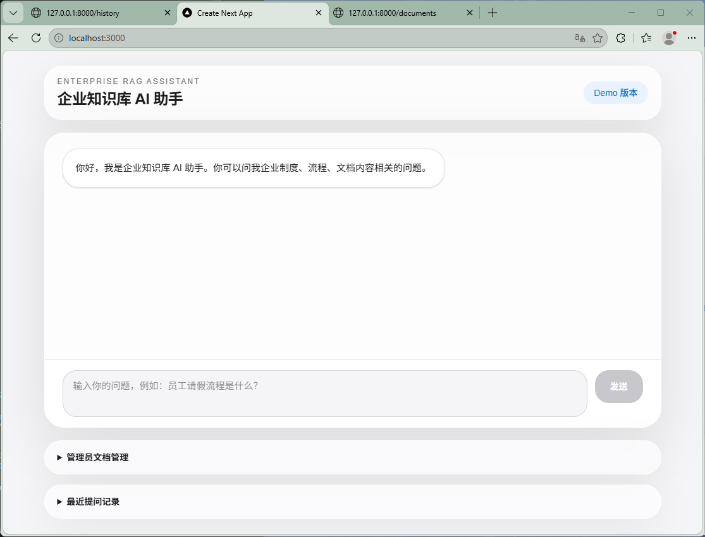
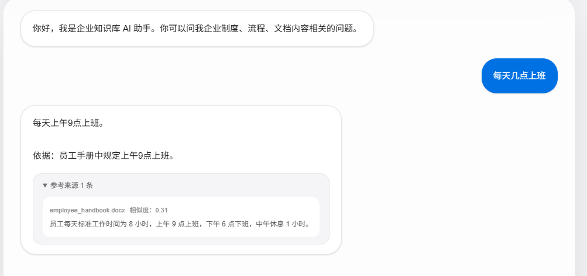
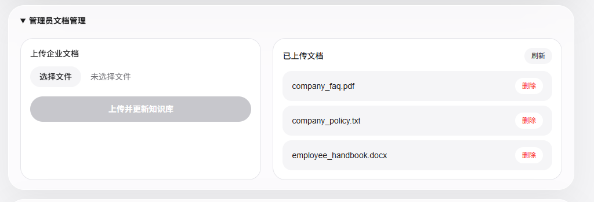
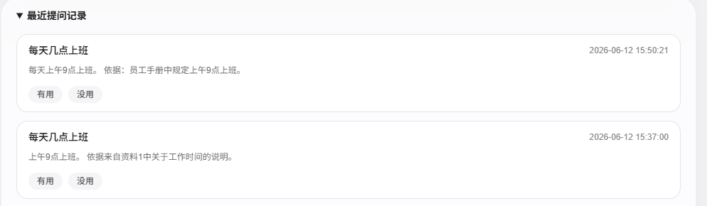

# 企业知识库 AI 助手

一个面向 FDE 学习和面试展示的企业知识库 RAG 项目。

本项目模拟企业内部知识查询场景：员工可以在网页中提问，系统会从企业文档中检索相关资料，并让 AI 基于资料生成回答，同时展示参考来源、历史记录和用户反馈。

---

## 1. 项目目标

在企业内部，员工经常需要查询制度、流程、FAQ、员工手册等资料。

传统方式通常是：

- 翻找 Word / PDF 文档
- 询问 HR、行政、主管
- 在聊天群里重复提问
- 等待人工回复

这些方式会造成查询效率低、重复沟通多、员工体验差、企业知识难以沉淀。

本项目的目标是构建一个企业知识库 AI 助手，让员工可以直接通过网页提问，由 AI 基于企业文档回答问题，从而提升企业内部知识获取效率。

---

## 2. 核心功能

### 2.1 AI 问答

用户可以在前端页面输入问题，系统会调用后端接口进行处理。

流程：

~~~text
用户输入问题
-> 前端发送请求
-> 后端接收问题
-> 检索企业知识库
-> 调用大模型生成回答
-> 返回答案和参考来源
~~~

### 2.2 RAG 知识库问答

本项目使用 RAG 思路减少 AI 幻觉。

RAG 流程：

~~~text
读取企业文档
-> 文本切分
-> 存入知识库
-> 用户提问
-> 检索相关片段
-> 拼接上下文
-> AI 基于资料回答
~~~

### 2.3 文档上传与管理

系统支持上传企业文档：

- txt
- docx
- pdf

管理员可以上传文档、查看已上传文档、删除文档，并更新知识库。

### 2.4 参考来源展示

AI 回答后，前端会展示参考来源。

来源信息包括：

- 文档名
- 文档片段
- 相似度分数

系统会过滤低相似度来源，避免把无关内容误当成证据。

### 2.5 历史记录

系统会保存最近提问记录。

每条记录包含：

- 用户问题
- AI 回答
- 参考来源
- 提问时间

当前 Demo 使用 `history.json` 保存历史记录。

### 2.6 用户反馈

用户可以对回答进行反馈：

- 有用
- 没用

反馈可以帮助后续优化知识库、检索逻辑和 Prompt。

---

## 3. 技术栈

### 前端

- Next.js
- React
- TypeScript
- Tailwind CSS

### 后端

- Python
- FastAPI
- Uvicorn
- Pydantic

### AI 与 RAG

- DeepSeek API
- Chroma
- 文档切分
- 相似度检索
- Prompt 约束

### 文档处理

- pypdf
- python-docx
- txt 文件读取

### 工程化

- Git
- Docker
- Docker Compose
- dotenv

---

## 4. 项目结构

~~~text
fde-learning/
├── day4/
│   ├── main.py
│   ├── README.md
│   ├── Dockerfile
│   ├── .dockerignore
│   ├── requirements.txt
│   ├── .env.example
│   ├── documents/
│   └── history.json
│
├── day15-frontend/
│   ├── app/
│   ├── package.json
│   ├── Dockerfile
│   └── .dockerignore
│
├── docker-compose.yml
├── DEMO_GUIDE.md
└── screenshots/
~~~

说明：

- `day4`：FastAPI 后端
- `day15-frontend`：Next.js 前端
- `docker-compose.yml`：一键启动前后端
- `DEMO_GUIDE.md`：演示流程文档
- `screenshots`：项目截图

---

## 5. 环境变量

后端需要配置 DeepSeek API Key。

在 `day4` 目录下创建 `.env` 文件：

~~~text
DEEPSEEK_API_KEY=your_api_key_here
~~~

注意：

~~~text
.env 不能上传到 GitHub
~~~

项目中提供了 `.env.example` 作为示例。

---

## 6. 本地开发启动

### 6.1 启动后端

~~~powershell
cd "E:\VS  CODE\fde-learning\day4"
python -m uvicorn main:app --reload
~~~

后端地址：

~~~text
http://127.0.0.1:8000
~~~

### 6.2 启动前端

~~~powershell
cd "E:\VS  CODE\fde-learning\day15-frontend"
npm run dev
~~~

前端地址：

~~~text
http://localhost:3000
~~~

---

## 7. Docker 启动

本项目支持 Docker Compose 启动前端和后端。

### 7.1 启动前准备

确认 Docker Desktop 已启动。

检查 Docker：

~~~powershell
docker --version
docker ps
~~~

### 7.2 一键启动

在项目根目录运行：

~~~powershell
cd "E:\VS  CODE\fde-learning"
docker compose up --build
~~~

启动成功后访问：

~~~text
前端：http://localhost:3000
后端：http://127.0.0.1:8000
~~~

### 7.3 停止服务

在运行 `docker compose up` 的终端按：

~~~text
Ctrl + C
~~~

或者执行：

~~~powershell
docker compose down
~~~

---

## 8. 主要接口

### 8.1 AI 问答接口

~~~text
POST /ask-doc
~~~

作用：接收用户问题，检索企业文档，调用 AI，返回答案和参考来源。

### 8.2 上传文档接口

~~~text
POST /upload-doc
~~~

作用：上传 txt / docx / pdf 文档，并更新知识库。

### 8.3 查看文档接口

~~~text
GET /documents
~~~

作用：查看当前已上传的文档。

### 8.4 删除文档接口

~~~text
DELETE /documents/{file_name}
~~~

作用：删除指定文档，并更新知识库。

### 8.5 历史记录接口

~~~text
GET /history
~~~

作用：查看最近提问记录。

### 8.6 反馈接口

~~~text
POST /feedback
~~~

作用：保存用户对 AI 回答的反馈。

---

## 9. 安全设计

项目中以下内容不会上传到 GitHub：

~~~text
.env
.venv/
documents/
history.json
__pycache__/
*.pyc
~~~

原因：

- `.env`：保存 API Key
- `documents/`：可能包含企业内部资料
- `history.json`：可能包含用户真实问题
- `.venv/`：本地虚拟环境

当前 Demo 已经做了：

- API Key 使用 `.env` 管理
- 文档目录加入 `.gitignore`
- 历史记录加入 `.gitignore`
- 参考来源展示
- 低相似度来源过滤
- 用户反馈功能
- 权限设计文档
- 风险清单文档

---

## 10. 企业上线考虑

如果真实上线，需要继续补充：

### 权限

- 用户登录
- 角色权限
- 部门文档隔离
- 管理员文档审核
- 后端接口鉴权

### 数据

- PostgreSQL 保存历史记录
- 文档元数据表
- 用户反馈表
- 操作日志表

### 安全

- 敏感信息脱敏
- Prompt Injection 防护
- API Key 服务端管理
- 日志审计
- 高风险问题转人工

### 成本

- token 消耗统计
- 高频问题缓存
- 限制单用户调用次数
- 根据问题复杂度选择不同模型

### 部署

- Docker Compose
- 数据卷 volume
- 生产环境配置
- 监控和告警

---

## 11. 当前限制

当前项目仍然是 Demo 版本，主要限制包括：

- 没有真实登录系统
- 权限控制还停留在设计阶段
- 历史记录暂时使用本地 JSON 文件
- 未接入 PostgreSQL
- 未实现 token 成本统计
- Docker 首次启动后可能需要重新上传文档触发知识库重建
- 尚未部署到真实服务器

---

## 12. 面试说明

这个项目展示的是一个 FDE 入门作品集 Demo。

它体现了以下能力：

- 从企业问题出发设计 AI 原型
- 使用 RAG 减少 AI 幻觉
- 完成前后端联调
- 接入企业文档
- 展示引用来源
- 保存历史记录
- 收集用户反馈
- 考虑权限、安全、成本和部署

一句话总结：

~~~text
这个项目不是普通聊天机器人，而是一个面向企业知识查询场景的 AI 落地原型。
~~~

---

## 13. 后续计划

后续可以继续优化：

- 接入 PostgreSQL
- 实现真实登录和权限控制
- 使用 pgvector 或更完整的 Chroma 持久化方案
- 增加 token 成本统计
- 增加流式输出
- 增加管理员统计面板
- 部署到云服务器

```powershell
docker compose up --build
```

---

## 项目截图

### 聊天首页



### AI 回答和参考来源



### 管理员文档管理



### 历史记录和反馈

