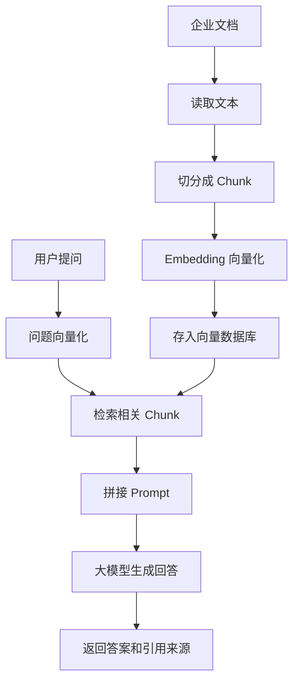

# RAG 流程图

```mermaid
flowchart TD
    A[企业文档] --> B[读取文本]
    B --> C[切分成 Chunk]
    C --> D[Embedding 向量化]
    D --> E[存入向量数据库]

    F[用户提问] --> G[问题向量化]
    G --> H[检索相关 Chunk]
    E --> H
    H --> I[拼接 Prompt]
    I --> J[大模型生成回答]
    J --> K[返回答案和引用来源]
```

## 一句话解释

RAG 就是先从企业文档中检索相关内容，再让 AI 基于这些资料回答问题。